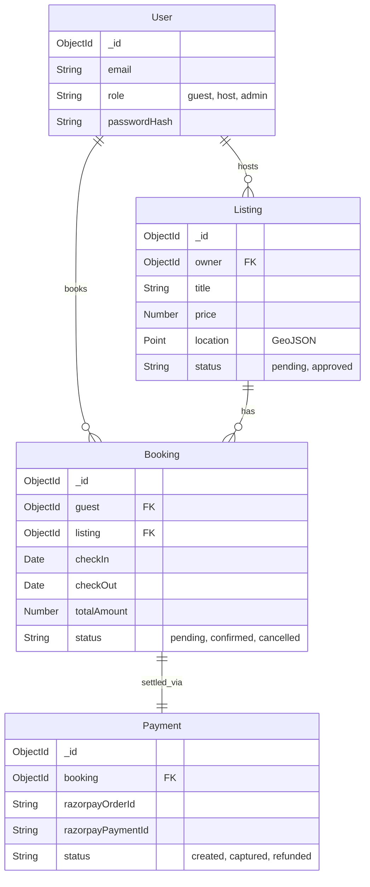

<div align="center">

# 🏡 Nestora — Backend System & API Architecture

**A production-ready, highly secure backend engine powering a multi-vendor hospitality marketplace.**

[](https://nodejs.org/)
[](https://expressjs.com/)
[](https://mongoosejs.com/)
[](https://razorpay.com/)
[](https://opensource.org/licenses/MIT)

[Architecture](#-system-architecture) • [Concurrency](#-concurrency--race-condition-handling) • [Security](#-security-posture) • [Payments](#-payment-state-machine--webhooks) • [Database](#-database-design) • [Quickstart](#-quickstart)

</div>

---

## 📌 Project Overview

**Nestora** is a monolithic Node.js application built to demonstrate advanced backend engineering principles. While it serves a fully functional EJS-based frontend, its core focus is on **data integrity, secure transaction processing, multi-role authorization, and robust API design**.

The platform connects guests with hosts while providing administrators with oversight capabilities, mimicking the complexities of modern booking systems.

---

## 🏗️ System Architecture

Built on a strict **Model-View-Controller (MVC)** pattern, the system emphasizes separation of concerns, middleware-driven authorization, and scalable database interactions.

- **Routing & Controllers**: Express.js handles HTTP routing, delegating business logic to isolated controllers.
- **Middleware Pipeline**: Requests pass through a rigorous pipeline: Rate Limiting → Helmet (Security Headers) → Session Parsing → CSRF Validation → Authentication (Passport.js) → Role Authorization (RBAC) → Validation → Controller execution.
- **Data Access Layer**: Mongoose ORM models define strict schemas, pre/post hooks, and virtual properties, abstracting MongoDB operations.
- **Error Handling**: A centralized global error handler catches async exceptions, distinguishing between operational errors (4xx) and system faults (5xx), ensuring no stack traces leak to the client.

---

## ⚡ Concurrency & Race Condition Handling

A major challenge in booking systems is the **Double-Booking Problem**. Nestora solves this at the database level using atomic operations, rather than relying on application-level locks.

### Zero Double-Booking Guarantee
When a booking is initiated, the system queries the `Booking` collection to ensure no overlapping approved bookings exist for the requested date range:
```javascript
const overlapping = await Booking.findOne({
  listing: listingId,
  status: { $in: ["confirmed", "pending"] },
  $or: [
    { checkIn: { $lt: requestedCheckOut }, checkOut: { $gt: requestedCheckIn } }
  ]
});
```
*If concurrent requests bypass the application check, MongoDB unique compound indexes and atomic updates act as a hard constraint to prevent collisions.*

---

## 🛡️ Security Posture

Nestora is hardened against common web vulnerabilities (OWASP Top 10):

| Threat | Mitigation Strategy |
|---|---|
| **XSS (Cross-Site Scripting)** | EJS automatic escaping; `helmet` configuring strict Content-Security-Policy (CSP) headers restricting `script-src` and `connect-src`. |
| **CSRF (Cross-Site Request Forgery)** | Synchronizer Token Pattern. Cryptographic CSRF tokens generated per session, verified via custom middleware on all state-changing endpoints (POST/PUT/DELETE). |
| **Authentication & Sessions** | `passport-local` with `bcrypt` (salt rounds: 12). Sessions persisted in MongoDB (`connect-mongo`) with `httpOnly`, `lax` sameSite, and `secure` (in prod) flags. |
| **IDOR / Broken Access Control** | Deep middleware checks (`isOwner`, `isAdmin`, `isHost`) verifying the `req.user._id` against the resource's owner reference before granting mutation rights. |
| **Rate Limiting & Abuse** | In-memory rate limiting applied to authentication and webhook endpoints to mitigate brute-force and DDoS attempts. |

---

## 💳 Payment State Machine & Webhooks

The payment flow leverages **Razorpay**, emphasizing server-side authority and webhook idempotency.

1. **Server-Side Price Authority**: The client never sends the price. The server calculates the exact total (nights × nightly rate + platform fees) based on the database listing to generate the Razorpay Order.
2. **Cryptographic Integrity**: When the client completes checkout, the payload is verified using **HMAC-SHA256**.
   ```javascript
   const expectedSignature = crypto
     .createHmac("sha256", process.env.RAZORPAY_KEY_SECRET)
     .update(order_id + "|" + payment_id)
     .digest("hex");
   ```
3. **Webhook Idempotency**: The `/webhook/razorpay` endpoint receives asynchronous events (`payment.captured`, `refund.processed`). The handler verifies the webhook signature using `express.raw()` body parsing and ensures state updates are idempotent, preventing duplicate booking confirmations.

---

## 🗄️ Database Design

The schema is heavily normalized with strict references (`ObjectId`), utilizing Mongoose `populate` for data aggregation.



### Indexing Strategy
- **Geospatial Indexing**: `2dsphere` indexes on `Listing.geometry` for future proximity-based search capabilities.
- **Compound Indexes**: Unique indexes on `Wishlist(user, listing)` to prevent duplicate favorites natively at the DB level.
- **Query Optimization**: Indexes on `Booking.listing` and `Booking.checkIn`/`checkOut` to optimize the high-frequency overlap detection queries.

---

## 🧪 Testing & CI

Nestora utilizes **Supertest** and **Mocha/Jest** methodologies for deep integration testing, operating on isolated test databases.

- **API Integration Tests**: End-to-end simulation of the request lifecycle (Registration → Login → Book → Payment Verification → Webhook Handling).
- **Environment Isolation**: The application explicitly refuses to run tests if connected to a production or non-test MongoDB URI, ensuring zero risk of accidental data mutation.
- **CI Pipeline readiness**: Automated linting and test scripts (`npm test`) configured to block deployments on failure.

---

## 🚀 Quickstart

### 1. Prerequisites
- **Node.js** v18.0.0+
- **MongoDB** local (`mongodb://127.0.0.1:27017`) or Atlas URI
- **Razorpay Account** (Test Mode credentials)
- **Cloudinary Account** (For image uploads)

### 2. Setup
```bash
git clone https://github.com/your-username/nestora.git
cd nestora
npm install
cp .env.example .env
```

**Configure `.env`:**
```env
PORT=8080
NODE_ENV=development
MONGODB_URI=mongodb://127.0.0.1:27017/nestora
SESSION_SECRET=your_super_secure_secret

# Razorpay Test Credentials
RAZORPAY_KEY_ID=rzp_test_...
RAZORPAY_KEY_SECRET=...
RAZORPAY_WEBHOOK_SECRET=...

# Cloudinary
CLOUDINARY_CLOUD_NAME=...
CLOUDINARY_API_KEY=...
CLOUDINARY_API_SECRET=...

# Mapbox
MAPBOX_TOKEN=pk....
```

### 3. Run the Server
```bash
# Seed initial admin account
npm run seed:admin

# Start development server
npm run dev
```

Run test suites:
```bash
npm test
```

---

## 📄 License
This project is licensed under the [MIT License](LICENSE).
