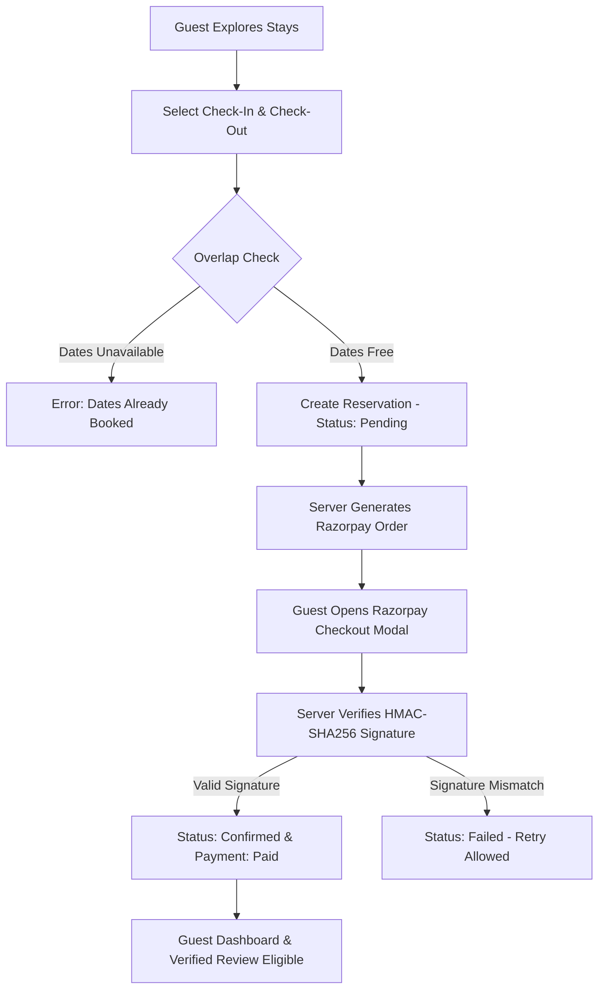
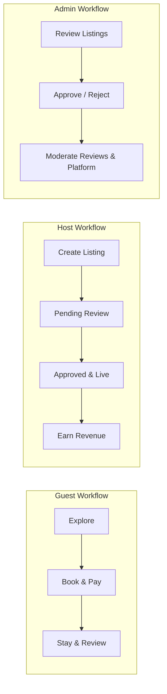
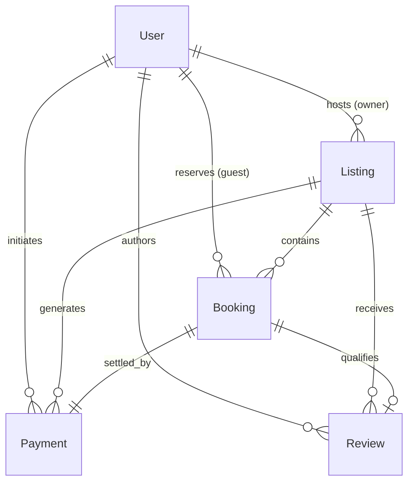

<div align="center">

# 🏡 Nestora — Hotel & Stay Booking Platform

**A full-stack, multi-vendor hospitality marketplace connecting travelers with verified accommodations worldwide.**

[](https://nodejs.org/)
[](https://expressjs.com/)
[](https://mongoosejs.com/)
[](https://razorpay.com/)
[](https://opensource.org/licenses/MIT)

[Features](#-key-features) • [Tech Stack](#-tech-stack) • [Workflows](#-application--role-workflows) • [Architecture](#-architecture--database-design) • [Quickstart](#-quickstart--installation) • [Screenshots](#-screenshots)

</div>

---

## 📌 Project Overview

**Nestora** is a production-ready web application built on the classic **MVC (Model-View-Controller)** architecture. It provides a complete end-to-end stay reservation ecosystem with distinct role hierarchies, real-time double-booking prevention, server-side cryptographic payment verification with Razorpay, stay-verified reviews, and interactive role-based analytics dashboards.

### 🎯 Key Highlights
- **Zero Double-Booking Guarantee:** Mathematical date-overlap query logic prevents conflicting stays.
- **Server-Side Price Authority:** Total amounts, night calculations, and fees are calculated exclusively on the backend.
- **Cryptographic Payment Integrity:** HMAC-SHA256 signature verification validates all Razorpay transactions.
- **High-Trust Reviews:** Only verified guests with completed stays can post ratings.

---

## ✨ Key Features

| Area | Feature Description |
|---|---|
| 🔐 **Authentication & Security** | Multi-role access control (`guest`, `host`, `admin`), bcrypt password hashing, `connect-mongo` session persistence, and CSRF/XSS-hardened cookies. |
| 🏡 **Property Management** | Hosts create listings with location, capacity, amenities, and multiple image uploads to Cloudinary. |
| 🛡️ **Admin Approval Lifecycle** | Host properties start in `pending` status and become publicly searchable only after Admin review and approval. |
| 🔍 **Search & Multi-Param Filters** | MongoDB query engine for keywords/cities, property types, price slider, guest count, and amenities. |
| 📅 **Booking Engine** | Date validation, past date blocking, host self-booking prevention, and instant availability locking. |
| 💳 **Razorpay Checkout** | Server-side order creation, standard client checkout modal, and backend signature verification. |
| ⭐ **Stay-Verified Reviews** | 1–5 star rating system with duplicate review prevention and real-time average rating calculation. |
| 📊 **Role Dashboards** | Dedicated portals for Guests (`/profile`), Hosts (`/host/dashboard`), and Admins (`/admin`). |

---

## 👥 User Roles & Permissions

```text
┌──────────────┐    ► Search approved stays, book dates, checkout with Razorpay,
│    Guest     │      view itineraries, and submit reviews for verified stays.
└──────────────┘
┌──────────────┐    ► All Guest privileges + list properties, upload gallery images,
│     Host     │      track incoming bookings, and monitor hosting revenue.
└──────────────┘
┌──────────────┐    ► Full platform governance: approve/reject listings, moderate reviews,
│    Admin     │      manage users, inspect transactions, and track gross booking volume.
└──────────────┘
```

---

## 🛠️ Tech Stack

- **Runtime & Framework:** Node.js (v18+) & Express.js 4.x
- **Database & ODM:** MongoDB & Mongoose 8.x
- **Authentication & Sessions:** Passport.js (`passport-local`), `bcrypt`, `connect-mongo`
- **View Engine & Styling:** EJS, `ejs-mate`, Modular CSS (`base.css`, `components.css`, `pages.css`)
- **Payment Gateway:** Razorpay Node SDK (`razorpay` v2.9) & Razorpay Checkout Modal
- **Media & Mapping:** Cloudinary (`multer-storage-cloudinary`), Mapbox GL JS

---

## 🔄 Application & Role Workflows

### 1. Reservation & Payment Lifecycle



### 2. Multi-Role Workflows



---

## 🏗️ Architecture & Database Design

### MVC Architecture
Nestora adheres to a strict Model-View-Controller pattern:
- **Models (`/models`):** Define MongoDB schemas, validation rules, and indexes.
- **Views (`/views`):** Server-rendered EJS templates structured with modular layouts and partials.
- **Controllers (`/controllers`):** Encapsulate business logic, payment verification, and role permissions.

### Entity Relationship Model



---

## 📁 Project Structure

```text
nestora/
├── config/               # Cloudinary & third-party configurations
├── controllers/          # Route controllers (auth, listings, bookings, payments, reviews, admin, host)
├── middleware/           # Role authorization (isLoggedIn, isHost, isAdmin), errors, ownership
├── models/               # Mongoose schemas (User, Listing, Booking, Payment, Review)
├── public/
│   ├── css/              # Modular stylesheets (base.css, components.css, pages.css, style.css)
│   └── js/               # Client-side scripts (flash alerts, UI helpers)
├── routes/               # Express routers (auth, listings, bookings, reviews, host, admin, index)
├── scripts/              # Automated test suites and seed scripts
├── views/                # EJS views, partials (navbar, footer, flash), and layouts
├── docs/screenshots/     # UI screenshot assets
├── .env.example          # Environment variable template
└── app.js                # Application entrypoint & server setup
```

---

## 🚀 Quickstart & Installation

### 1. Prerequisites
- **Node.js** v18.0.0+
- **MongoDB** local instance (`mongodb://127.0.0.1:27017`) or MongoDB Atlas URI
- **Razorpay Account** (Test Mode credentials)

### 2. Clone & Install
```bash
git clone https://github.com/your-username/nestora.git
cd nestora
npm install
```

### 3. Setup Environment Variables
Copy `.env.example` to `.env`:
```bash
cp .env.example .env
```

```env
PORT=8080
NODE_ENV=development
MONGODB_URI=mongodb://127.0.0.1:27017/nestora
SESSION_SECRET=your_random_secure_session_secret

# Cloudinary
CLOUDINARY_CLOUD_NAME=your_cloud_name
CLOUDINARY_API_KEY=your_api_key
CLOUDINARY_API_SECRET=your_api_secret

# Mapbox
MAPBOX_TOKEN=your_mapbox_public_token

# Razorpay (Test Credentials)
RAZORPAY_KEY_ID=rzp_test_your_key_id
RAZORPAY_KEY_SECRET=your_razorpay_secret
RAZORPAY_WEBHOOK_SECRET=your_webhook_secret
```

### 4. Seed Default Admin Account (Optional)
```bash
npm run seed:admin
```
- **Username:** `admin` | **Password:** `Admin@123`

### 5. Start the Server
```bash
# Development (with nodemon)
npm run dev

# Production
npm start
```
Open **`http://localhost:8080`** in your browser.

---

## 🧪 Testing

Run the full end-to-end multi-role test suite:
```bash
npm test
```

Specialized test runners:
```bash
node scripts/test-razorpay-payments.js   # Razorpay verification & double-booking protection
node scripts/test-phase11-home.js        # Homepage UI & responsive components
node scripts/test-phase10-audit.js       # Multi-role access control & IDOR audit
```

---

## 💳 Razorpay Test Mode Setup

1. Sign up at [Razorpay Dashboard](https://dashboard.razorpay.com/) and toggle **Test Mode**.
2. Go to **Settings &rarr; API Keys** and generate **Key ID** and **Key Secret**.
3. Add `RAZORPAY_KEY_ID` and `RAZORPAY_KEY_SECRET` to `.env`.
4. In the checkout modal, use any test UPI ID (e.g. `success@razorpay`) or test card numbers.

---

## 📸 Screenshots

To showcase the live UI, add PNG screenshots to [`docs/screenshots/`](docs/screenshots/):

| Page | Recommended Screenshot File | Description |
|---|---|---|
| **Homepage** | `docs/screenshots/01-homepage.png` | Hero search card, categories, featured stays, and footer |
| **Property Details** | `docs/screenshots/02-property-details.png` | Image gallery, amenities, host badge, map, and booking card |
| **Booking & Payment** | `docs/screenshots/03-razorpay-checkout.png` | Price summary and Razorpay Checkout modal |
| **Host Dashboard** | `docs/screenshots/04-host-dashboard.png` | Property catalog, approval status, and hosting revenue |
| **Admin Dashboard** | `docs/screenshots/05-admin-dashboard.png` | Platform analytics, pending approvals, and review moderation |

> *Note: Place your captured `.png` images in the `docs/screenshots/` folder with the filenames above.*

---

## 🌐 Production Deployment

1. **Deploy to Render / Railway / VPS:** Set Build Command to `npm install` and Start Command to `npm start`.
2. **Configure Environment Variables:** Add production values for `MONGODB_URI`, `SESSION_SECRET`, `NODE_ENV=production`, Cloudinary, Mapbox, and Razorpay.
3. **Configure Razorpay Webhook:** In Razorpay Dashboard &rarr; Settings &rarr; Webhooks, add `https://your-domain.com/webhook/razorpay` with events `order.paid`, `payment.captured`, and `payment.failed`.

---

## 🔮 Future Improvements

- **In-App Messaging:** Real-time WebSockets chat between guests and hosts.
- **Automated Payouts:** Razorpay Route integration for automated host revenue transfers.
- **Multi-Currency Support:** Dynamic currency conversion based on user location.

---

## 📄 License

This project is licensed under the [MIT License](LICENSE).
