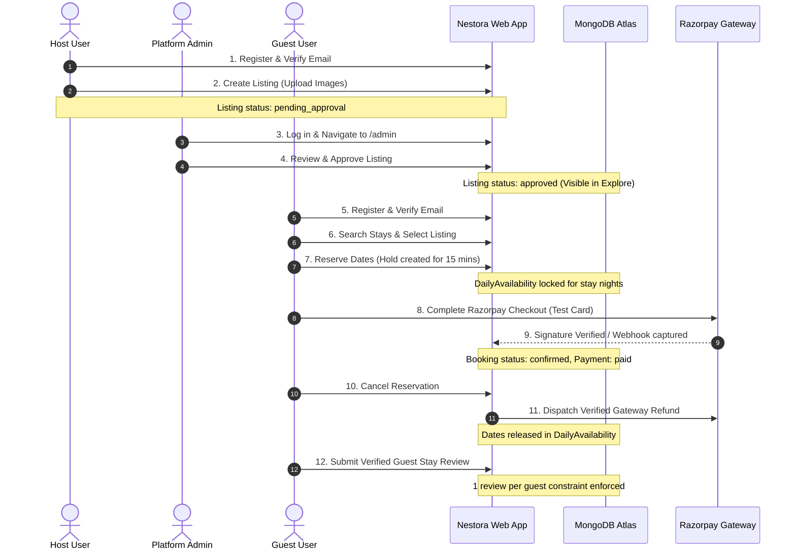

# Nestora — Manual End-to-End Smoke Test Guide

This manual testing guide enables quality assurance engineers and deployment operators to verify the complete Nestora lifecycle on staging before opening the platform to closed beta users.

---

## Complete Smoke Test Flow

---

## Step-by-Step Execution Checklist

### Step 1: Host Registration & Email Verification
1. Navigate to `/register`.
2. Enter:
   - Username: `smoke_host`
   - Email: `smoke_host@example.com`
   - Password: `Password@123`
3. Click **Create Account**.
4. Check your email (or staging inbox / server logs) for the verification link:
   `https://<your-domain>/verify-email/<token>`
5. Click the link &rarr; confirm flash banner: *"Your email has been successfully verified! Thank you."*

---

### Step 2: Host Creates a Property Listing
1. Navigate to `/listings/new` (or click **Become a Host** / **List Your Property**).
2. Fill in:
   - **Title:** `Lakeside Alpine Villa`
   - **Description:** `Breathtaking mountain and lake views with private dock.`
   - **Nightly Rate (₹):** `7500`
   - **Location:** `Nainital, Uttarakhand`
   - **Country:** `India`
   - **Property Type:** `Villa`
   - **Max Guests:** `6`
   - **Cancellation Policy:** `Flexible`
   - **Images:** Upload 1–3 JPEG/PNG photos.
3. Submit form &rarr; verify flash message: *"Listing created and submitted for admin review."*
4. Confirm property is **not** visible in public `/listings` explore search yet.

---

### Step 3: Admin Reviews & Approves Listing
1. Log in as an Administrator (`/login`).
2. Navigate to `/admin`.
3. Locate `Lakeside Alpine Villa` under **Pending Approval**.
4. Click **Approve Property**.
5. Verify flash banner: *"Listing approved and published successfully."*
6. Visit `/listings` &rarr; verify the villa card renders with title, image, rate, and location.

---

### Step 4: Guest Registers & Creates Reservation Hold
1. In a private browser window / incognito session, navigate to `/register`.
2. Register Guest:
   - Username: `smoke_guest`
   - Email: `smoke_guest@example.com`
   - Password: `Password@123`
3. Verify email via verification token.
4. Browse to `Lakeside Alpine Villa` (`/listings/:id`).
5. Select reservation dates (e.g. 5 days from today for 3 nights) and 2 guests.
6. Click **Reserve Now**.
7. Confirm redirect to `/bookings/:id/payment` &rarr; verify stay overview card and price calculation breakdown.
8. In a separate tab as another user, try to reserve the same dates on the same villa &rarr; verify immediate rejection with *"These dates are already reserved or held by another guest."*

---

### Step 5: Complete Razorpay Test Payment
1. On `/bookings/:id/payment`, click **Pay ₹22,500 with Razorpay**.
2. In the Razorpay modal:
   - Method: **Card**
   - Card Number: `4111 1111 1111 1111` (Test Visa)
   - Expiry: Any future date (e.g. `12/30`)
   - CVV: `123`
   - OTP: `123456` / Success
3. Verify redirect to `/bookings/:id` with flash message: *"Payment verified and booking confirmed!"*
4. Confirm reservation status badge: `CONFIRMED`, payment badge: `PAID`.

---

### Step 6: Test Razorpay Webhook
1. In Razorpay Dashboard &rarr; Webhooks, send a test webhook payload for `payment.captured`.
2. Inspect server logs &rarr; confirm `POST /webhook/razorpay 200 OK` with log: `[Webhook] Successfully processed event: payment.captured`.

---

### Step 7: Booking Cancellation & Verified Gateway Refund
1. On the booking details page `/bookings/:id`, click **Cancel Reservation**.
2. Confirm modal popup warning.
3. Verify redirect with flash message detailing refund percentage (e.g. 100% refund for flexible policy > 24h prior to check-in).
4. Verify booking status badge transitions to `CANCELLED`, refund status: `COMPLETED` (or `PENDING` with refund ID).
5. Verify dates in `DailyAvailability` are released immediately.

---

### Step 8: Verified Guest Review Submission
1. Navigate back to the listing page `/listings/:id`.
2. In the **Leave a Review** section:
   - Rating: ⭐⭐⭐⭐⭐ (5 Stars)
   - Comment: *"Incredible stay, pristine views, and seamless check-in experience!"*
3. Click **Submit Review**.
4. Confirm review appears under **Guest Reviews**.
5. Attempt to submit a second review for the same stay &rarr; confirm rejection: *"You have already reviewed this stay."*

---

### Step 9: Verify Admin Audit Log
1. Log in as Admin &rarr; Navigate to `/admin/audit-logs`.
2. Verify all operations appear chronologically:
   - `user.registered` (Host & Guest)
   - `listing.created`
   - `listing.approved`
   - `booking.created`
   - `booking.payment_verified`
   - `booking.cancelled`
   - `review.created`
