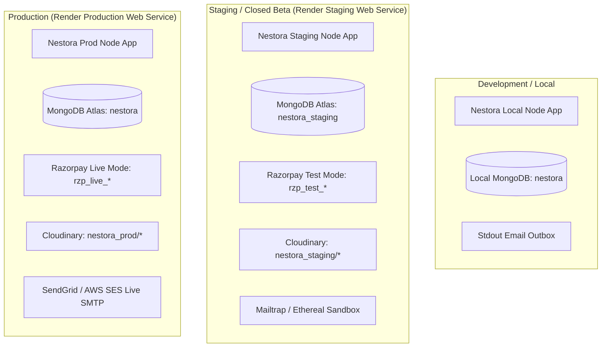

# Nestora — Staging & Closed-Beta Environment Guide

This document defines the architecture, isolation requirements, and configuration matrix for running the **Nestora Staging and Closed-Beta Environment**.

---

## 1. Staging Isolation Architecture

The staging environment is a 1-to-1 replica of production running on isolated infrastructure to ensure that pre-release testing and beta verification never affect production user data or financial transactions.



---

## 2. Environment Configuration Matrix

| Variable | Local Development | Staging / Closed Beta | Production |
|---|---|---|---|
| `NODE_ENV` | `development` | `staging` / `production` | `production` |
| `PORT` | `8080` | `8080` | `8080` |
| `MONGODB_URI` | `mongodb://127.0.0.1:27017/nestora` | `mongodb+srv://.../nestora_staging` | `mongodb+srv://.../nestora` |
| `SESSION_SECRET` | Auto-fallback or dev key | 64-char random hex string | 64-char random hex string |
| `ENABLE_LIVE_PAYMENTS` | `false` | `false` (Sandbox held) | `true` |
| `RAZORPAY_KEY_ID` | `rzp_test_...` (Sandbox) | `rzp_test_...` (Sandbox) | `rzp_live_...` (Live Gateway) |
| `RAZORPAY_KEY_SECRET` | Test Secret | Test Secret | Live Secret |
| `RAZORPAY_WEBHOOK_SECRET` | Test Webhook Secret | Staging Webhook Secret | Production Webhook Secret |
| `CLOUDINARY_CLOUD_NAME` | Dev Cloud Name | Staging Cloud Name | Production Cloud Name |
| `CLOUDINARY_API_KEY` | Dev API Key | Staging API Key | Production API Key |
| `CLOUDINARY_API_SECRET` | Dev API Secret | Staging API Secret | Production API Secret |
| `MAPBOX_ACCESS_TOKEN` | Public Mapbox Token | Public Mapbox Token | Public Mapbox Token |
| `SMTP_HOST` | *(Optional - stdout outbox)* | `smtp.mailtrap.io` | `smtp.sendgrid.net` |
| `SMTP_PORT` | `587` | `2525` / `587` | `587` |
| `SMTP_USER` | `null` | Mailtrap User | `apikey` |
| `SMTP_PASS` | `null` | Mailtrap Password | SendGrid API Key |
| `EMAIL_FROM` | `Nestora Dev <dev@nestora.com>` | `Nestora Beta <beta@nestora.com>` | `Nestora <notifications@nestora.com>` |
| `APP_BASE_URL` | `http://localhost:8080` | `https://staging-nestora.onrender.com` | `https://nestora.onrender.com` |

---

## 3. Staging Deployment on Render

1. **Create Staging Web Service:**
   - In Render Dashboard, click **New +** &rarr; **Web Service**.
   - Connect the `khilarivishal26/nestora` repository.
   - Name: `nestora-staging`.
   - Branch: `main` (or `staging`).
   - Build Command: `npm ci --omit=dev`.
   - Start Command: `npm start`.
   - Health Check Path: `/health`.

2. **Configure Staging Environment Variables:**
   - Paste the values from the Staging column above.
   - Verify `ENABLE_LIVE_PAYMENTS=false`.

3. **Initialize Staging Admin User:**
   ```bash
   # Execute inside Render Shell or locally targeting staging URI:
   ADMIN_USERNAME=beta_admin ADMIN_EMAIL=beta-admin@nestora.com ADMIN_PASSWORD=BetaAdminPass@2026 npm run seed:admin
   ```

4. **Verify Staging Webhook:**
   - Add webhook endpoint in Razorpay Dashboard (Test Mode):
     `https://staging-nestora.onrender.com/webhook/razorpay`
   - Select events: `payment.captured`, `payment.failed`, `refund.processed`.
